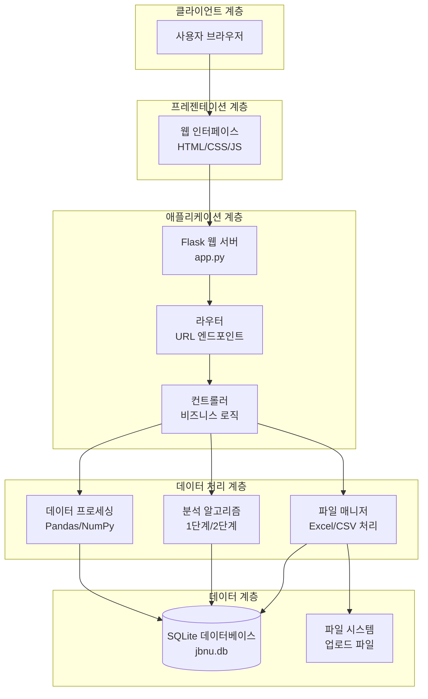
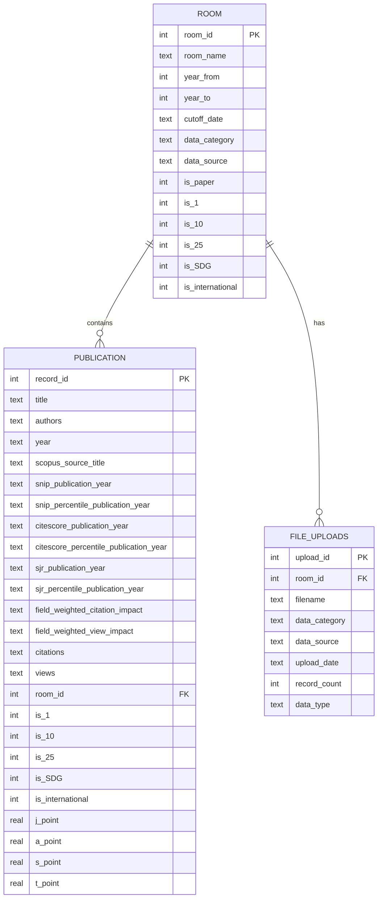
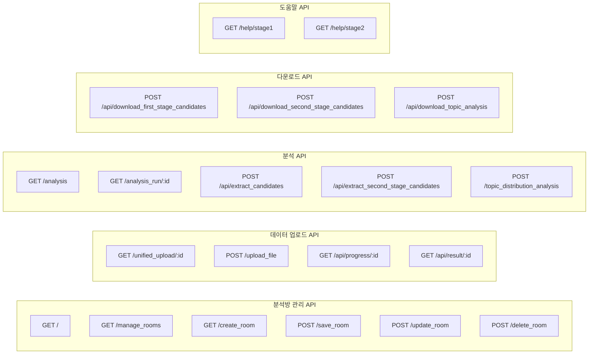
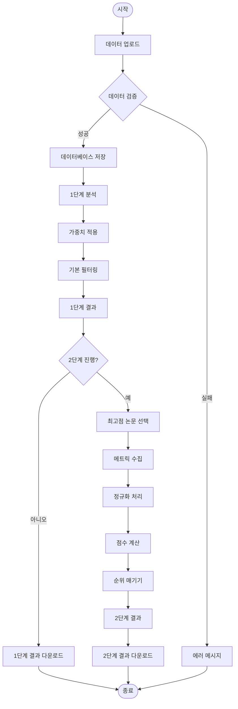
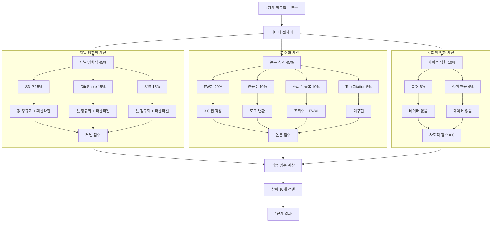
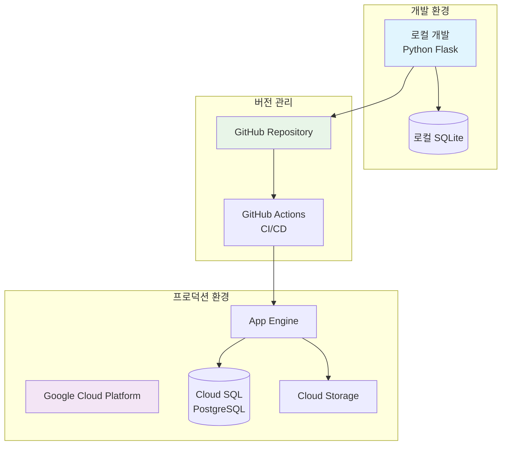
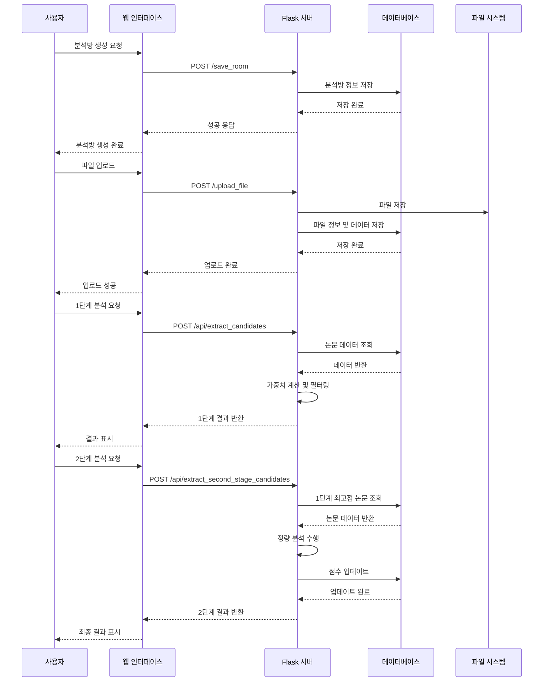

# JBNU ORAP 아키텍처 다이어그램

## 시스템 전체 아키텍처

```mermaid
graph TB
    subgraph "클라이언트 계층"
        U[사용자 브라우저]
    end
    
    subgraph "프레젠테이션 계층"
        W[웹 인터페이스<br/>HTML/CSS/JS]
    end
    
    subgraph "애플리케이션 계층"
        F[Flask 웹 서버<br/>app.py]
        R[라우터<br/>URL 엔드포인트]
        C[컨트롤러<br/>비즈니스 로직]
    end
    
    subgraph "데이터 처리 계층"
        DP[데이터 프로세싱<br/>Pandas/NumPy]
        AA[분석 알고리즘<br/>1단계/2단계]
        FM[파일 매니저<br/>Excel/CSV 처리]
    end
    
    subgraph "데이터 계층"
        DB[(SQLite 데이터베이스<br/>jbnu.db)]
        FS[파일 시스템<br/>업로드 파일]
    end
    
    U --> W
    W --> F
    F --> R
    R --> C
    C --> DP
    C --> AA
    C --> FM
    DP --> DB
    AA --> DB
    FM --> FS
    FM --> DB
```

## 데이터베이스 ERD

```mermaid
erDiagram
    ROOM {
        int room_id PK
        text room_name
        int year_from
        int year_to
        text cutoff_date
        text data_category
        text data_source
        int is_paper
        int is_1
        int is_10
        int is_25
        int is_SDG
        int is_international
    }
    
    PUBLICATION {
        int record_id PK
        text title
        text authors
        text year
        text scopus_source_title
        text snip_publication_year
        text snip_percentile_publication_year
        text citescore_publication_year
        text citescore_percentile_publication_year
        text sjr_publication_year
        text sjr_percentile_publication_year
        text field_weighted_citation_impact
        text field_weighted_view_impact
        text citations
        text views
        int room_id FK
        int is_1
        int is_10
        int is_25
        int is_SDG
        int is_international
        real j_point
        real a_point
        real s_point
        real t_point
    }
    
    FILE_UPLOADS {
        int upload_id PK
        int room_id FK
        text filename
        text data_category
        text data_source
        text upload_date
        int record_count
        text data_type
    }
    
    ROOM ||--o{ PUBLICATION : contains
    ROOM ||--o{ FILE_UPLOADS : has
```

## API 엔드포인트 구조

```mermaid
graph LR
    subgraph "분석방 관리 API"
        A1[GET /]
        A2[GET /manage_rooms]
        A3[GET /create_room]
        A4[POST /save_room]
        A5[POST /update_room]
        A6[POST /delete_room]
    end
    
    subgraph "데이터 업로드 API"
        B1[GET /unified_upload/:id]
        B2[POST /upload_file]
        B3[GET /api/progress/:id]
        B4[GET /api/result/:id]
    end
    
    subgraph "분석 API"
        C1[GET /analysis]
        C2[GET /analysis_run/:id]
        C3[POST /api/extract_candidates]
        C4[POST /api/extract_second_stage_candidates]
        C5[POST /topic_distribution_analysis]
    end
    
    subgraph "다운로드 API"
        D1[POST /api/download_first_stage_candidates]
        D2[POST /api/download_second_stage_candidates]
        D3[POST /api/download_topic_analysis]
    end
    
    subgraph "도움말 API"
        E1[GET /help/stage1]
        E2[GET /help/stage2]
    end
```

## 분석 프로세스 플로우

```mermaid
flowchart TD
    Start([시작]) --> Upload[데이터 업로드]
    Upload --> Validate{데이터 검증}
    Validate -->|실패| Error[에러 메시지]
    Validate -->|성공| Store[데이터베이스 저장]
    
    Store --> Stage1[1단계 분석]
    Stage1 --> Weight1[가중치 적용]
    Weight1 --> Filter1[기본 필터링]
    Filter1 --> Result1[1단계 결과]
    
    Result1 --> Stage2{2단계 진행?}
    Stage2 -->|아니오| Download1[1단계 결과 다운로드]
    Stage2 -->|예| Select[최고점 논문 선택]
    
    Select --> Metrics[메트릭 수집]
    Metrics --> Normalize[정규화 처리]
    Normalize --> Calculate[점수 계산]
    Calculate --> Rank[순위 매기기]
    Rank --> Result2[2단계 결과]
    Result2 --> Download2[2단계 결과 다운로드]
    
    Download1 --> End([종료])
    Download2 --> End
    Error --> End
```

## 2단계 분석 알고리즘 구조

```mermaid
flowchart TB
    Input[1단계 최고점 논문들] --> Process[데이터 전처리]
    
    Process --> J[저널 영향력 45%]
    Process --> P[논문 성과 45%]
    Process --> S[사회적 영향 10%]
    
    subgraph "저널 영향력 계산"
        J --> J1[SNIP 15%]
        J --> J2[CiteScore 15%]
        J --> J3[SJR 15%]
        J1 --> JN1[값 정규화 + 퍼센타일]
        J2 --> JN2[값 정규화 + 퍼센타일]
        J3 --> JN3[값 정규화 + 퍼센타일]
        JN1 --> JS[저널 점수]
        JN2 --> JS
        JN3 --> JS
    end
    
    subgraph "논문 성과 계산"
        P --> P1[FWCI 20%]
        P --> P2[인용수 10%]
        P --> P3[조회수 블록 10%]
        P --> P4[Top Citation 5%]
        P1 --> PN1[3.0 캡 적용]
        P2 --> PN2[로그 변환]
        P3 --> PN3[조회수 + FWVI]
        P4 --> PN4[미구현]
        PN1 --> PS[논문 점수]
        PN2 --> PS
        PN3 --> PS
        PN4 --> PS
    end
    
    subgraph "사회적 영향 계산"
        S --> S1[특허 6%]
        S --> S2[정책 인용 4%]
        S1 --> SN1[데이터 없음]
        S2 --> SN2[데이터 없음]
        SN1 --> SS[사회적 점수 = 0]
        SN2 --> SS
    end
    
    JS --> Final[최종 점수 계산]
    PS --> Final
    SS --> Final
    Final --> Ranking[상위 10개 선별]
    Ranking --> Output[2단계 결과]
```

## 배포 아키텍처

```mermaid
graph TB
    subgraph "개발 환경"
        Dev[로컬 개발<br/>Python Flask]
        DevDB[(로컬 SQLite)]
        Dev --> DevDB
    end
    
    subgraph "버전 관리"
        Git[GitHub Repository]
        Action[GitHub Actions<br/>CI/CD]
    end
    
    subgraph "프로덕션 환경"
        GCP[Google Cloud Platform]
        AppEngine[App Engine]
        CloudSQL[(Cloud SQL<br/>PostgreSQL)]
        Storage[Cloud Storage]
        
        AppEngine --> CloudSQL
        AppEngine --> Storage
    end
    
    Dev --> Git
    Git --> Action
    Action --> AppEngine
    
    style Dev fill:#e1f5fe
    style GCP fill:#f3e5f5
    style Git fill:#e8f5e8
```

## 사용자 인터렉션 플로우

```mermaid
sequenceDiagram
    participant U as 사용자
    participant W as 웹 인터페이스
    participant S as Flask 서버
    participant D as 데이터베이스
    participant F as 파일 시스템

    U->>W: 분석방 생성 요청
    W->>S: POST /save_room
    S->>D: 분석방 정보 저장
    D-->>S: 저장 완료
    S-->>W: 성공 응답
    W-->>U: 분석방 생성 완료

    U->>W: 파일 업로드
    W->>S: POST /upload_file
    S->>F: 파일 저장
    S->>D: 파일 정보 및 데이터 저장
    D-->>S: 저장 완료
    S-->>W: 업로드 완료
    W-->>U: 업로드 성공

    U->>W: 1단계 분석 요청
    W->>S: POST /api/extract_candidates
    S->>D: 논문 데이터 조회
    D-->>S: 데이터 반환
    S->>S: 가중치 계산 및 필터링
    S-->>W: 1단계 결과 반환
    W-->>U: 결과 표시

    U->>W: 2단계 분석 요청
    W->>S: POST /api/extract_second_stage_candidates
    S->>D: 1단계 최고점 논문 조회
    D-->>S: 논문 데이터 반환
    S->>S: 정량 분석 수행
    S->>D: 점수 업데이트
    D-->>S: 업데이트 완료
    S-->>W: 2단계 결과 반환
    W-->>U: 최종 결과 표시
```